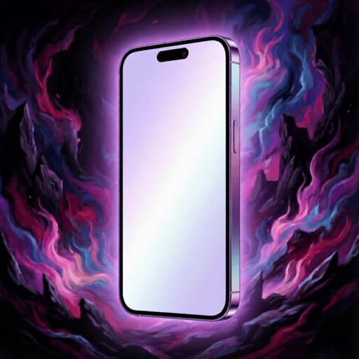
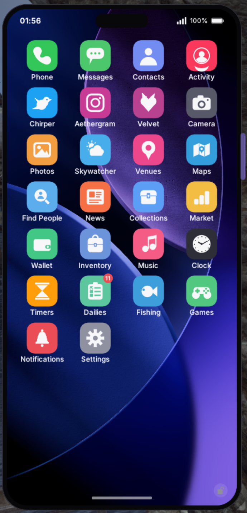

<p align="center">
  
</p>

<h1 align="center">Aetherphone</h1>

<p align="center">
  <a href="https://www.aetherphone.net/"></a>
  <a href="https://github.com/XeldarAlz/FFXIV-Aetherphone/releases/latest"></a>
  <a href="https://github.com/XeldarAlz/FFXIV-Aetherphone/releases"></a>
  <a href="https://github.com/XeldarAlz/FFXIV-Aetherphone/actions/workflows/release.yml"></a>
  <a href="LICENSE.md"></a>
</p>

<p align="center">
  <a href="README.md"></a>
  <a href="README.de.md"></a>
  <a href="README.fr.md"></a>
  <a href="README.es.md"></a>
  <a href="README.tr.md"></a>
  <a href="README.zh.md"></a>
  <a href="README.ja.md"></a>
  <a href="README.ru.md"></a>
</p>

<p align="center">
  <em>Un smartphone, hecho para ti. Construido sobre Dalamud.</em>
</p>

<p align="center">
  <a href="https://www.aetherphone.net/"><strong>www.aetherphone.net</strong></a>
</p>

---

<p align="center">
  
</p>

## Qué es

Aetherphone es un plugin de Dalamud gratuito y de código abierto que pone un smartphone real en pantalla en FINAL FANTASY XIV: un dispositivo anclado y siempre visible, con pantalla de inicio, notificaciones, tonos de llamada y fondos de pantalla personalizables. Tras las aplicaciones funciona su propia red social para los usuarios de Aetherphone, de modo que operan entre personajes y sesiones, no solo de forma local.

La privacidad y la seguridad son lo primero: los mensajes de texto, los adjuntos y las notas de voz están cifrados de extremo a extremo, las llamadas van cifradas en tránsito, y las publicaciones e imágenes pasan por una moderación con IA con reglas de contenido claras.

## Lo más destacado

- **Social**: el microblog Chirper, el feed de fotos Aethergram, ChocoChat para mensajería privada con notas de voz y llamadas de grupo, y Velvet, una aplicación complementaria opcional para mayores de 18 años.
- **Utilidades**: un rastreador del mercado, un directorio de locales y eventos, música en el juego, el clima, una cartera, temporizadores y reinicios, una fototeca y cámara, y un salón recreativo de bolsillo de minijuegos, entre más de 30 aplicaciones.
- **Hazlo tuyo**: paletas de acento, fondos de pantalla, retratos de personaje del Lodestone, tonos de llamada personalizados y un zoom de accesibilidad para el tamaño del texto.

El recorrido completo por las funciones, capturas de pantalla y detalles están en el sitio web:

→ **[www.aetherphone.net](https://www.aetherphone.net/)**

## Instalación

En el juego: `/xlsettings` → **Experimental** → pega en **Custom Plugin Repositories**:

```
https://raw.githubusercontent.com/XeldarAlz/DalamudPlugins/main/repo.json
```

Marca **Enabled**, haz clic en **+** y luego en **Save and Close**. Abre `/xlplugins` → **All Plugins**, busca **Aetherphone** e instálalo.

## Comandos

| Comando | Acción |
|---|---|
| `/phone` | Mostrar/ocultar el teléfono |
| `/aetherphone` | Alias de `/phone` |
| `/phone about` | Abrir créditos / enlaces |
| `/phone reset` | Volver a centrar el teléfono en pantalla |

## Más cosas mías

Si te ha gustado este plugin, echa un vistazo a mis otros trabajos para Dalamud. Puede que encuentres algo más para ti.

→ [XeldarAlz Dalamud Plugins](https://github.com/XeldarAlz/DalamudPlugins)

## Licencia

AGPL-3.0-or-later. Consulta [LICENSE.md](LICENSE.md).
