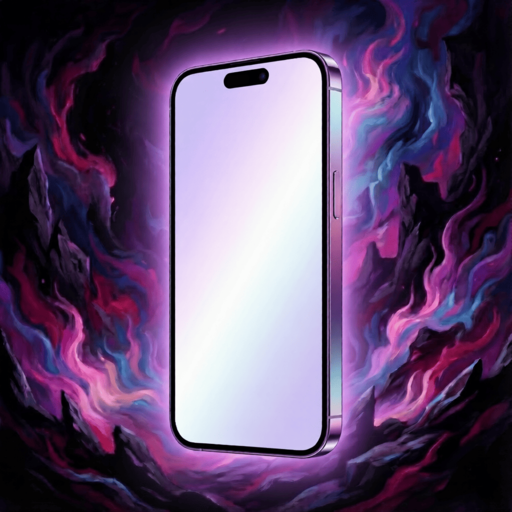
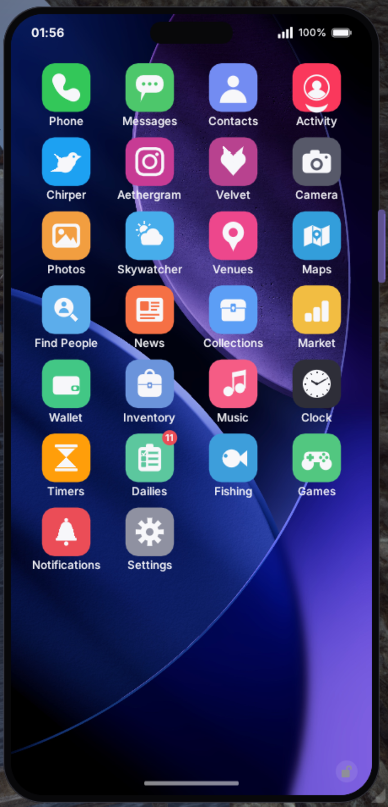

<p align="center">
  
</p>

<h1 align="center">Aetherphone</h1>

<p align="center">
  <a href="https://www.aetherphone.net/"></a>
  <a href="https://discord.gg/3HbJCscMyS"></a>
  <a href="https://github.com/XeldarAlz/FFXIV-Aetherphone/releases/latest"></a>
  <a href="https://github.com/XeldarAlz/FFXIV-Aetherphone/releases"></a>
  <a href="https://github.com/XeldarAlz/FFXIV-Aetherphone/actions/workflows/release.yml"></a>
  <a href="LICENSE.md"></a>
</p>

<p align="center">
  <a href="README.md"></a>
  <a href="README.de.md"></a>
  <a href="README.fr.md"></a>
  <a href="README.es.md"></a>
  <a href="README.pt.md"></a>
  <a href="README.tr.md"></a>
  <a href="README.zh.md"></a>
  <a href="README.ja.md"></a>
  <a href="README.ru.md"></a>
</p>

<p align="center">
  <em>Senin için tasarlanmış bir akıllı telefon. Dalamud üzerine kuruldu.</em>
</p>

<p align="center">
  <a href="https://www.aetherphone.net/"><strong>www.aetherphone.net</strong></a>
</p>

---

<p align="center">
  
</p>

## Nedir

Aetherphone, FINAL FANTASY XIV içinde ekrana gerçek bir akıllı telefon getiren, ücretsiz ve açık kaynaklı bir Dalamud eklentisidir: ana ekranı, uygulama değiştiricisi, bildirimleri, zil sesleri ve temalandırılabilir duvar kağıtları olan, sabitlenmiş ve her zaman açık bir cihaz. Uygulamaların arkasında Aetherphone kullanıcıları için kendi sosyal ağı çalışır; böylece uygulamalar yalnızca yerel olarak değil, karakterler ve oturumlar arasında çalışır.

Gizlilik ve güvenlik her şeyden önce gelir: metin mesajları, ekler ve sesli notlar uçtan uca şifrelidir, aramalar aktarım sırasında şifrelenir; gönderiler ile görseller, net içerik kuralları çerçevesinde insanlardan oluşan bir moderasyon ekibi tarafından incelenir.

## Öne çıkanlar

- **Sosyal**: bir mikroblog, bir fotoğraf akışı ve sesli notlar ile grup aramalarına sahip özel mesajlaşma, ayrıca isteğe bağlı bir 18+ yardımcı uygulama.
- **Oyun sohbeti**: oyundaki tüm sohbet kanalları telefonda; sekmeleri kendin oluşturursun, tell mesajları ise ayrı konuşmalar olarak gelir.
- **Araçlar**: bir pazar takipçisi, bir konut tarayıcısı, mekan ve etkinlik rehberi, canlı topluluk radyo istasyonları ve Rolladeck DJ listeleriyle oyun içi müzik, hava durumu, bir cüzdan, zamanlayıcılar ve sıfırlamalar, bir fotoğraf kitaplığı ve kamera, kısayollar ve bir cep mini oyun salonu; 40 uygulama arasında.
- **Birlikte izleyin**: YouTube dahil videolar oyun içindeki bir ekranda, birlikte izleyen herkes için eşitlenmiş oynatmayla. Yerel dosyalar da çalışır: her izleyici kendi kopyasını seçer ve eşitlenmiş kalır.
- **Kumarhane**: oyun parasıyla blackjack, slotlar, kazı kazan kartları, ortak bir çark ve tombala. Gerçek para yoktur ve hiçbir şeyin nakit değeri yoktur.
- **Kendine göre yap**: istediğin vurgu rengi, duvar kağıtları, Lodestone karakter portreleri, özel zil sesleri, göze batmayan arayüz sesleri, yazı boyutu yakınlaştırması ve istediğin boyuta sürükleyebileceğin bir telefon. Küçültülmüşken yalnızca seçtiğin parçaları, seçtiğin sırayla gösterir: saat, tarih, şimdi çalıyor, aramalar, bildirim kartları, okunmamış rozeti ve Eorzea saati, hava, sonraki sıfırlama, gil, Aether Coin, hizmetkâr görevleri ve etkinlik halkaları için widget'lar.

Tüm özellik turu, ekran görüntüleri ve ayrıntılar web sitesinde:

→ **[www.aetherphone.net](https://www.aetherphone.net/)**

## Kurulum

Oyun içinde: `/xlsettings` → **Experimental** → **Custom Plugin Repositories** alanına yapıştırın:

```
https://raw.githubusercontent.com/XeldarAlz/DalamudPlugins/main/repo.json
```

**Enabled** kutusunu işaretleyin, **+** düğmesine tıklayın, ardından **Save and Close** deyin. `/xlplugins` → **All Plugins** açın, **Aetherphone** araması yapın ve kurun.

Oyunun Çin sürümünde mi oynuyorsunuz? Telefon bunu algılar, orada kullanılamayan uygulamaları (Music, AetherStream ve News) gizler ve Lodestone yerine Rising Stones (石之家) profilinizle giriş yapmanızı sağlar.

## Komutlar

| Komut | Eylem |
|---|---|
| `/phone` | Telefonu aç/kapat |
| `/aetherphone` | `/phone` için takma ad |
| `/phone run <name>` | Bir kısayolu adıyla çalıştır; böylece bir hotbar makrosuna yerleştirilebilir |
| `/phone market [item]` | Pazarı aç; bir eşya adı verirsen onu arar |
| `/phone reset` | Telefonu ekranda yeniden ortala |
| `/phone test` | Örnek bir bildirim gönder |

## Topluluk

Sorular, fikirler ya da sadece diğer oyuncularla takılmak mı istiyorsun? Discord'a uğra.

→ [Discord'umuza katıl](https://discord.gg/3HbJCscMyS)

## Katkıda bulunma

Aetherphone açık kaynaklıdır ve katkılara açıktır. Önce geliştirici belgeleriyle (İngilizce) başlayın, ardından katkı rehberini okuyun. Bunun yerine sekiz çeviriden birini mi geliştirmek istiyorsunuz? Bunun için ne kod, ne derleme, ne de git gerekir: çevirmen rehberi tüm adımları tarayıcı üzerinden anlatır.

→ [Geliştirici belgeleri](docs/README.md) · [Katkı rehberi](CONTRIBUTING.md) · [Çevirmen rehberi](docs/translating.md)

## Benden dahası

Bu eklentiyi beğendiyseniz, diğer Dalamud çalışmalarıma bir göz atın. Orada size uygun başka bir şey bulabilirsiniz.

→ [XeldarAlz Dalamud Plugins](https://github.com/XeldarAlz/DalamudPlugins)

## Yasal

Çevrimiçi özellikleri kullanmak, hizmet şartlarını kabul etmek anlamına gelir. Gizlilik politikası, Aethernet hizmetinin verilerinizle ne yaptığını kapsar; çevrimdışı özellikler makinenizde kalır, ancak bazı uygulamalar herkese açık oyun verilerini doğrudan üçüncü taraf hizmetlerden alır ve politika bunu da kapsar.

→ [Hizmet Şartları](TERMS.md) · [Gizlilik Politikası](PRIVACY.md) · [Marka ve İsim Politikası](TRADEMARK.md)

## Lisans

AGPL-3.0-or-later. Bkz. [LICENSE.md](LICENSE.md).
