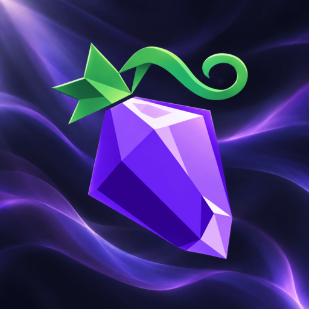

<p align="center">
  
</p>

<h1 align="center">Aetherphone</h1>

<p align="center">
  <strong>Votre personnage a enfin un téléphone.</strong><br>
  Un réseau social, une messagerie, un lecteur de musique et des dizaines d'autres applications, intégrés à FINAL FANTASY XIV.
</p>

<p align="center">
  <a href="https://github.com/XeldarAlz/FFXIV-Aetherphone/releases/latest"></a>
  <a href="https://github.com/XeldarAlz/FFXIV-Aetherphone/releases"></a>
  <a href="https://discord.gg/3HbJCscMyS"></a>
  <a href="../../LICENSE.md"></a>
</p>

<p align="center">
  <a href="#install"><strong>Installation</strong></a> ·
  <a href="https://www.aetherphone.net/"><strong>Site web</strong></a> ·
  <a href="https://www.aetherphone.net/summer-2026/"><strong>Rétrospective de l'été</strong></a> ·
  <a href="https://discord.gg/3HbJCscMyS"><strong>Discord</strong></a>
</p>

<p align="center">
  
</p>

<p align="center">
  <a href="../../README.md">English</a> ·
  <a href="README.de.md">Deutsch</a> ·
  <strong>Français</strong> ·
  <a href="README.es.md">Español</a> ·
  <a href="README.pt.md">Português</a> ·
  <a href="README.tr.md">Türkçe</a> ·
  <a href="README.zh.md">中文</a> ·
  <a href="README.ja.md">日本語</a> ·
  <a href="README.ru.md">Русский</a>
</p>

## Le premier été, en chiffres

Aethernet a ouvert ses portes le 2 juillet 2026. À la fin de la saison, les joueurs de 113 mondes avaient accompli tout ceci :

<p align="center">
  <a href="https://www.aetherphone.net/summer-2026/"></a>
</p>

<p align="center"><sub>Chiffres au 28 septembre 2026. <a href="https://www.aetherphone.net/summer-2026/">Découvrez la Rétrospective de l'été 2026 complète</a>.</sub></p>

## Une vie sociale au cœur du jeu

<table>
  <tr>
    <td width="50%" valign="top">
      
      <h3> Chirper</h3>
      <em>Des messages courts venus de tout Éorzéa.</em>
      <ul>
        <li>Les fils Pour vous et Récents, avec un filtre Abonnements</li>
        <li>Rechirps, citations, réponses et hashtags</li>
        <li>Photos, GIF et treize réactions</li>
        <li>Les chirps dans d'autres langues traduits d'un geste</li>
      </ul>
    </td>
    <td width="50%" valign="top">
      
      <h3> Aethergram</h3>
      <em>Pris en jeu. Partagé sur Aethergram.</em>
      <ul>
        <li>Jusqu'à huit photos directement depuis votre galerie</li>
        <li>Des stories qui durent une journée</li>
        <li>Identifiez les personnes présentes sur la photo</li>
        <li>Un éditeur de photos intégré avant de partager</li>
      </ul>
    </td>
  </tr>
</table>

<table>
  <tr>
    <td width="50%" valign="top">
      
      <h3> ChocoChat</h3>
      <em>Votre numéro. Vos proches.</em>
      <ul>
        <li>Écrivez aux joueurs de n'importe quel monde ou centre de données</li>
        <li>Messages vocaux, photos et discussions de groupe</li>
        <li>Appels vocaux, en tête-à-tête ou en groupe</li>
        <li>Chiffrement de bout en bout</li>
      </ul>
    </td>
    <td width="50%" valign="top">
      
      <h3> Velvet <sup>18+</sup></h3>
      <em>À la nuit tombée, selon vos règles.</em>
      <ul>
        <li>Une carte qui dit ce que vous recherchez</li>
        <li>Parcourez les profils selon leurs envies</li>
        <li>Une discussion ne commence que si l'on répond à votre présentation</li>
        <li>Réservé aux adultes, avec son propre profil et ses propres règles</li>
      </ul>
    </td>
  </tr>
</table>

Un seul compte Aethernet vous connecte à toutes les applications sociales, et chacune peut garder son propre nom affiché et son propre nom d'utilisateur.

## Regarder, écouter et jouer ensemble

<table>
  <tr>
    <td valign="top">
      
      
      <h3> MogCast</h3>
      <em>Des soirées vidéo sur un écran que vous placez dans le monde.</em>
      <ul>
        <li>Déplacez, faites pivoter, courbez et redimensionnez l'écran là où vous vous tenez</li>
        <li>Une lecture synchronisée pour tout le groupe</li>
        <li>Les joueurs à proximité rejoignent d'un geste, vos amis où qu'ils soient avec un code</li>
        <li>Mettez en file des playlists YouTube et réagissez ensemble à l'écran</li>
      </ul>
    </td>
  </tr>
</table>

<table>
  <tr>
    <td width="50%" valign="top">
      
      <h3> Musique</h3>
      <em>Une vraie application de musique, avec vos amis en prime.</em>
      <ul>
        <li>Paroles synchronisées, playlists et écoute hors ligne</li>
        <li>Jam : le même morceau, synchronisé, avec vos amis</li>
        <li>Des milliers de stations de radio</li>
        <li>Contrôlez Spotify ou votre navigateur sur PC</li>
      </ul>
    </td>
    <td width="50%" valign="top">
      
      <h3> Lieux</h3>
      <em>Là où la nuit s'anime.</em>
      <ul>
        <li>Clubs, bars et cafés ouverts en ce moment</li>
        <li>Tous les événements de la semaine, à votre heure locale</li>
        <li>Un geste pour vous rendre jusqu'à la porte, avec Lifestream installé</li>
      </ul>
    </td>
  </tr>
</table>

## Et tout ce qu'un téléphone doit savoir faire

**Joue avec vous**<br>
         <br>
<sub>Onglets de discussion Linkpearl · Strats de raid · Chasses en direct · prix et alertes du Marché · loterie Housing · créneaux de Pêche · Jobs et ensembles d'équipement · recherche dans l'Inventaire · Quotidiens · Minuteurs des servants · Cartes · Collections de montures et de mascottes</sub>

**Rapproche les joueurs**<br>
    <br>
<sub>Rencontres Muster · petites annonces Yellow Pages · Annonces · Sondages · badges et cadres Aether Coin</sub>

**Utilitaires du quotidien**<br>
         <br>
<sub>Appareil photo · Photos avec éditeur intégré · Notes · Calendrier · Horloge à l'heure d'Éorzéa · Météorologue pour la météo · Portefeuille · Santé · Raccourcis · Actus du Lodestone · Calculatrice · anneaux d'Activité</sub>

**Pour souffler**<br>
      <br>
<sub>Une salle d'arcade de cinquante-neuf jeux, dont Doom · des onglets Accueil, Ensemble, Bibliothèque et Profil, avec le jeu du jour en direct en haut, un calendrier de série quotidienne et une icône peinte pour chaque jeu · des classements mondiaux et entre amis que tu ne rejoins que si tu le veux · plus Uno, les Échecs, le Billard 8-ball, le Puissance 4, Bordée, Coup de chance, Cratère et Mini-golf en ligne entre amis · Doom et Cratère, ainsi que les salons de Billard 8-ball et de Cratère, se jouent à l'horizontale</sub>

## Conçu comme le téléphone dans votre poche

**Intégré à votre HUD.** Déplacez-le où vous voulez, redimensionnez-le ou réduisez-le en mini-téléphone avec l'horloge, les widgets, la musique et les appels.

**Widgets et piles intelligentes.** Des widgets pour la plupart des applications, redimensionnables depuis leur coin et empilables en déposant l'un sur l'autre.

**Une Dynamic Island** pour les appels, la lecture, les minuteurs, les sorties en mer, les soirées vidéo et les rencontres.

**Spotlight et Centre de contrôle.** Tirez vers le bas sur l'écran d'accueil pour chercher des apps, des contacts, des réglages, des notes et des objets du marché, ou touchez le haut de l'écran pour la musique, le volume, la luminosité et Ne pas déranger.

**À votre image.** Fonds d'écran, couleurs d'accentuation, styles d'icônes, coques et disposition de l'écran d'accueil, enregistrés dans un style qui suit chaque personnage.

**Parle votre langue.** Neuf langues d'interface et une traduction en un geste sur les publications, les profils et les messages.

**Confidentiel par conception.** Les messages, les photos et les messages vocaux sont chiffrés de bout en bout. Une présentation Velvet est envoyée en texte clair. Une équipe humaine de modération examine les contenus signalés.

<a id="install"></a>

## Installation

En jeu : `/xlsettings` → **Experimental** → collez dans **Custom Plugin Repositories** :

```
https://aetherphone.net/repo.json
```

Cochez **Enabled**, cliquez sur **+**, puis sur **Save and Close**. Ouvrez `/xlplugins` → **All Plugins**, recherchez **Aetherphone** et installez-le. Tapez `/phone` pour le prendre en main.

Vous jouez sur le client chinois ? Le téléphone le détecte et vous connecte plutôt via votre profil Rising Stones (石之家).

<details>
<summary><strong>Commandes</strong></summary>

| Commande | Action |
|---|---|
| `/phone` | Afficher ou masquer le téléphone |
| `/aetherphone` | Alias de `/phone` |
| `/phone run <name>` | Lancer un raccourci par son nom, pour pouvoir le placer dans une macro de barre d'action |
| `/phone market [item]` | Ouvrir le marché, en recherchant un objet si vous en nommez un |
| `/phone reset` | Recentrer le téléphone à l'écran |
| `/phone test` | Envoyer une notification d'exemple |

</details>

## Communauté et contributions

L'assistance, les rapports de bugs et les suggestions se passent sur le **[Discord d'Aetherphone](https://discord.gg/3HbJCscMyS)**.

Aetherphone est open source et les contributions sont les bienvenues. Les traducteurs n'ont besoin ni de code ni de build : le guide du traducteur fonctionne dans un navigateur.

→ [Documentation développeur](../README.md) · [Guide de contribution](../../CONTRIBUTING.md) · [Guide du traducteur](../translating.md)

## Utilisation de l'IA

Aetherphone est développé avec des outils de programmation assistés par IA et déclare le niveau **Copilot** de la [politique IA de Dalamud](https://dalamud.dev/plugin-publishing/ai-policy/) : l'IA réalise l'essentiel de l'implémentation, tandis que des humains rédigent les spécifications, relisent chaque modification, la testent en jeu et répondent du résultat.

**Rien de ce que vous voyez ou entendez n'est généré par IA.** Chaque icône, fond d'écran, coque, son, sonnerie et police est original, dessiné par des artistes crédités ou issu d'une source sous licence. Le texte anglais est écrit à la main, et les huit autres langues sont des traductions assistées par IA, relues par des humains.

**Votre contenu vous appartient.** La traduction n'envoie que le texte que vous demandez à traduire, ou les fils et discussions pour lesquels vous activez la traduction automatique. Aucune IA ne modère Aethernet, et vos publications et messages ne servent jamais à entraîner des modèles d'IA.

→ [Utilisation de l'IA](../ai-usage.md) · [Mentions de tiers](../../THIRD-PARTY-NOTICES.md)

## Mentions légales

Utiliser les fonctionnalités en ligne vaut acceptation des [conditions d'utilisation](../../TERMS.md). La [politique de confidentialité](../../PRIVACY.md) couvre ce qu'Aethernet fait de vos données, et la [politique de marque et de nom](../../TRADEMARK.md) couvre le nom.

Sous licence AGPL-3.0-or-later. Voir [LICENSE.md](../../LICENSE.md). Un projet de fan indépendant, ni affilié à Square Enix ni approuvé par Square Enix.
