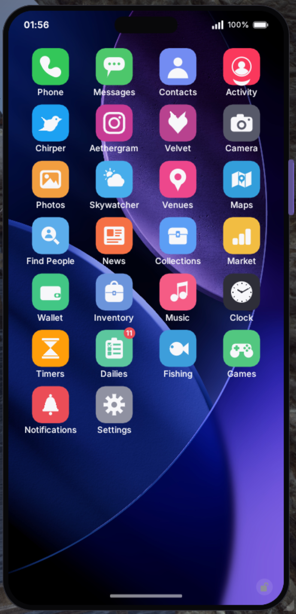

<p align="center">
  
</p>

<h1 align="center">Aetherphone</h1>

<p align="center">
  <a href="https://www.aetherphone.net/"></a>
  <a href="https://discord.gg/3HbJCscMyS"></a>
  <a href="https://github.com/XeldarAlz/FFXIV-Aetherphone/releases/latest"></a>
  <a href="https://github.com/XeldarAlz/FFXIV-Aetherphone/releases"></a>
  <a href="https://github.com/XeldarAlz/FFXIV-Aetherphone/actions/workflows/release.yml"></a>
  <a href="../../LICENSE.md"></a>
</p>

<p align="center">
  <a href="../../README.md"></a>
  <a href="README.de.md"></a>
  <a href="README.fr.md"></a>
  <a href="README.es.md"></a>
  <a href="README.pt.md"></a>
  <a href="README.tr.md"></a>
  <a href="README.zh.md"></a>
  <a href="README.ja.md"></a>
  <a href="README.ru.md"></a>
</p>

<p align="center">
  <em>FINAL FANTASY XIV のためのゲーム内スマートフォン。Dalamud 上に構築されています。</em>
</p>

<p align="center">
  <a href="https://www.aetherphone.net/"><strong>www.aetherphone.net</strong></a>
</p>

---

<p align="center">
  
</p>

## これは何か

Aetherphone は FINAL FANTASY XIV 向けの電話プラグインです。ホーム画面、アプリスイッチャー、通知を備えたドッキング端末として動きます。オンラインアプリはプラグイン独自のオンラインサービスである Aethernet 上で動くため、投稿したもの、送ったもの、保存したものは、あなたのマシンだけでなく Aethernet アカウントに保存されます。初期設定では各キャラクターがそれぞれのアカウントでサインインし、設定を変えると、選んだ 1 つのアカウントをすべてのキャラクターで使い続けられます。

## ハイライト

- **HUD に溶け込む電話。** 好きな場所へドラッグし、好きな大きさに変え、選んだウィジェットだけを表示するミニ電話に最小化できます。ミニ電話も通常の電話と同じように角からサイズを変えられます。リアルタイムのエリアミニマップに畳むこともでき、ゲームのミニマップがある位置に配置できます。
- **どのワールドのプレイヤーにもメッセージを。** ChocoChat は、あなたと相手がお互いの番号を保存すれば、ワールドやデータセンターをまたいで使えます。ボイスメッセージ、グループチャット、連絡先から発信できる音声通話つき。パーティも、フレンドリストも、移動も要りません。
- **自分たちのソーシャルアプリ。** 短文投稿の Chirper、写真の Aethergram、そして任意で使える 18+ の空間 Velvet（ララフェルのキャラクターでは利用できません）。1 つの Aethernet アカウントで 3 つすべてにサインインでき、アプリごとに表示名とユーザー名を分けられます。
- **ゲーム内チャットを丸ごと再構成。** Linkpearl はゲームのチャット全チャンネルを自分で組んだタブにまとめ、テルは個別の会話として扱い、チャンネルごとに色を分け、ゲームでは切れてしまう長文も分割して送信間隔を調整します。各タブはログ形式でも吹き出し形式でも読め、チャットのテーマと壁紙を選び、ゲームのチャンネル色を取り込み、スクリーンショット用に名前を隠せます。
- **電話を閉じたままチャット。** どの会話も電話の横に現れるフローティングウィンドウに切り出せます。新しいチャットはタブとしてそこに加えられ、戦闘中やコンテンツ中は隠れて、終わると自動で戻ってきます。
- **プレイに寄り添うアプリ。** 各ギミックで自分の担当位置が示される Strats のレイド攻略チートシート、モブハントとトレインのハント、オーシャンフィッシングの釣り、さらにマーケットボード、ハウジング、マップ、Venues (会場)、日課、コレクション、インベントリ。
- **日常の道具もひと通り。** メモ、自分の予定グループとリマインダーを使えるカレンダー、リセットとリテイナー用のタイマー、電卓、ウォレット、自分のアルバムと写真編集機能を備えたカメラと写真、時計、天気の Skywatcher、そしてホットバーのマクロから実行できるショートカット。
- **一緒に観て、一緒に聴く。** MogCast は電話や、ワールドに置いたスクリーンで動画を再生し、ウォッチパーティーに参加した近くの Aetherphone ユーザーと再生を同期します。ミュージックはコミュニティラジオ局、インターネットラジオ局、検索した曲を再生し、ライブ中の Rolladeck の DJ を一覧表示します。
- **あなたの言語で読める。** 投稿、プロフィール、プライベートメッセージはワンタップで翻訳でき、フィードとチャットでは新しい投稿やメッセージを届いたそばから翻訳できます。翻訳は Aethernet が行い、プライベートメッセージの翻訳は保存されません。
- **息抜きも中に。** Gamba は遊び用コインのカジノで、ブラックジャック、スロット、スクラッチ、ビンゴ、みんなで回すホイールがあり、どれも換金価値はありません。ゲームは Doom を含む 30 本のアーケードで、さらに Uno、チェス、8 ボールプールを友達とオンラインで遊べます。
- **自分好みに。** 好きな壁紙、自分で用意した着信音と通知音、任意のアクセントカラー、Lodestone のキャラクター立ち絵、控えめな UI サウンド、文字サイズのズーム。設定一式をルックとして保存でき、キャラクターごとに自分のルックを持てます。ログインしたキャラクターに合わせてホーム画面が切り替わります。
- **暗号化とモデレーション。** メッセージ、写真、ボイスメッセージは、電話が自動で作成する鍵によってエンドツーエンドで暗号化されます。メッセージを報告または翻訳すると、そのテキストが読める状態で Aethernet に送信されます。通話は通信経路で暗号化され、Aethernet サーバーを経由して中継されますが、エンドツーエンドでは暗号化されません。報告された投稿、画像、メッセージは、人によるモデレーションチームが確認します。

アプリは全部で 42 本。機能の全ツアー、スクリーンショット、詳細はウェブサイトでご覧いただけます。

→ **[www.aetherphone.net](https://www.aetherphone.net/)**

## インストール

ゲーム内で：`/xlsettings` → **Experimental** → **Custom Plugin Repositories** に貼り付け：

```
https://aetherphone.net/repo.json
```

**Enabled** にチェックを入れ、**+** をクリックし、**Save and Close** を押します。`/xlplugins` → **All Plugins** を開き、**Aetherphone** を検索してインストールします。

中国版でプレイしていますか？電話がそれを検出し、Lodestone の代わりに Rising Stones（石之家）のプロフィールでサインインし、必要なアプリは中国版のワールドとニュースフィードを参照します。

## コマンド

| コマンド | 動作 |
|---|---|
| `/phone` | 電話の表示を切り替える |
| `/aetherphone` | `/phone` のエイリアス |
| `/phone run <name>` | ショートカットを名前で実行する（ホットバーのマクロに置けるように） |
| `/phone market [item]` | マーケットボードを開き、アイテム名を指定すればそれを検索する |
| `/phone reset` | 電話を画面中央に戻す |
| `/phone test` | サンプル通知を送る |

## コミュニティ

サポート、不具合報告、提案は Aetherphone の Discord サーバーで受け付けています。

→ [Discordに参加](https://discord.gg/3HbJCscMyS)

## コントリビュート

Aetherphone はオープンソースで、コントリビュートを歓迎します。まず開発者向けドキュメント（英語）を読み、次にコントリビュートガイドをご覧ください。代わりに 8 つの翻訳のいずれかを改善したいですか？コードもビルドも git も不要です。翻訳者ガイドがブラウザーだけで進められる手順を案内します。

→ [開発者向けドキュメント](../README.md) · [コントリビュートガイド](../../CONTRIBUTING.md) · [翻訳者ガイド](../translating.md)

## 法的事項

オンライン機能を使用することは、利用規約への同意を意味します。プライバシーポリシーは Aethernet サービスがあなたのデータをどう扱うかを説明します。オフライン機能はあなたのマシン内にとどまり、一部のアプリはあなたのマシンから直接サードパーティのサービスに接続します。これもポリシーの対象です。

→ [利用規約](../../TERMS.md) · [プライバシーポリシー](../../PRIVACY.md) · [商標・名称ポリシー](../../TRADEMARK.md)

## ライセンス

AGPL-3.0-or-later。[LICENSE.md](../../LICENSE.md) を参照してください。
